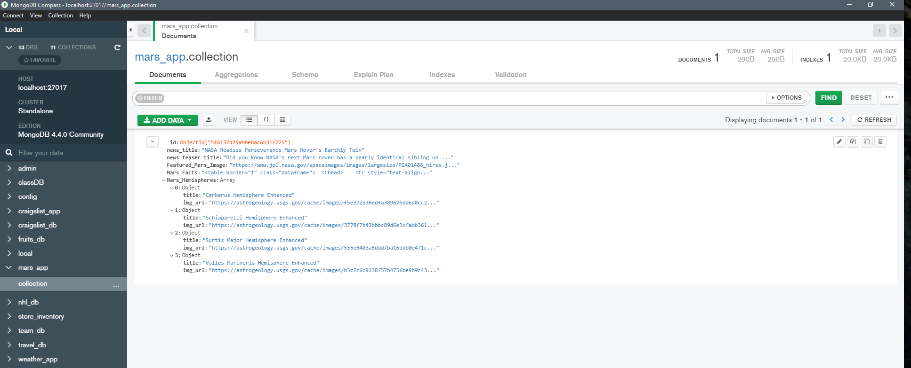
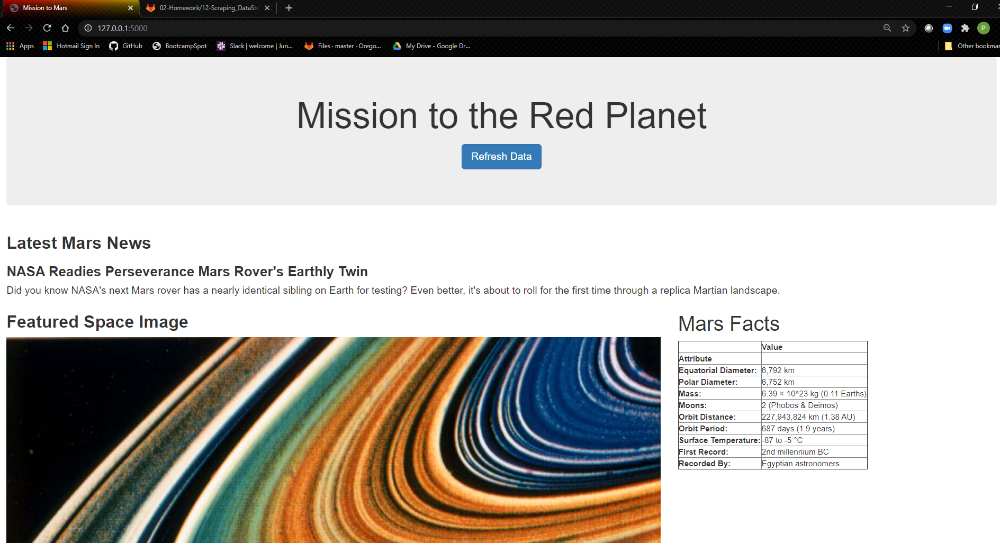
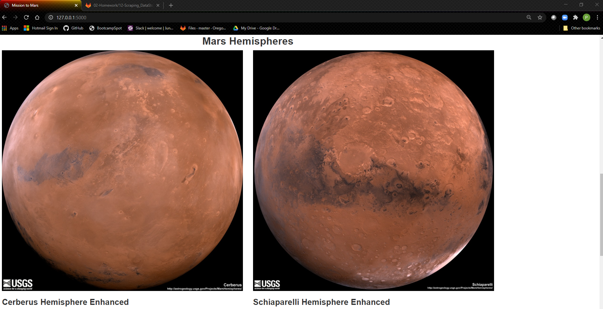
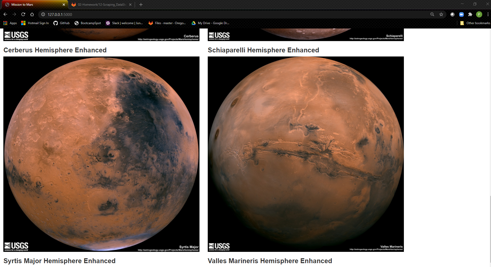

# web-scraping-challenge

## Please note:

### Section 1 - Scraping

1. All scraping requirements were met and are available in a Jupyter Notebook, here: [mission_to_mars.ipynb](Missions_to_Mars/mission_to_mars.ipynb)

2. All scraping data also appears in scrape_mars.py, which is executed from a route on the flask app triggered by the "Refresh Data" button on the landing page:
[scrape_mars.py](Missions_to_Mars/scrape_mars.py)

3. All scrapes save their results to variables, lists, or dictionaries, and are finally compiled into a single dictionary that returns the full data set to the flask app for final rendering.

### Section 2 - Mongo DB and Flask App 

1.  The flask app is run by executing "python app.py", this program contains both a root route and a route to refresh (scrape) new data.  It requires:
    
    The chromedriver.exe for windows to be available in the root path of app.py. 
    
    An Available MongoDb instance for writing and fetching data.

    The Chrome browser.

2. After scrape_mars.py completes a request to "refresh it's data, it saves the data to a collection in MongoDb. A screen shot showing the full collection in the mars_app db in MongoDb appears in the screen shot below: 

3. The template used as the index page for this application is index.html and can be found here: [index.html](Missions_to_Mars/templates/index.html). Bootstrap components and layout were used to structure the page.

4. Screen Shots of the fully loaded application appear below:

